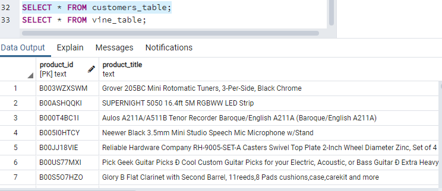

# Amazon_Vines_Analysis
## Overview
In this project we will be analysing a dataset from the Amazon Vine program, with the intention to find out if there is any bias from Vine members. We will be using Pyspark to Extract Transfor and Load the data to an AWS RDS instance using pgAdmin.
## Results
Before analysing the data set a few tables where created and uploaded to an AWS RDS instance using pgAdmin, here are some snippets of the tables created.  

  
Customer table.  

  
Product table.  

  
Reviews table.  

  
Vine table.  

From Pyspark we calculated the total count of vine member reviews with 5 stars and percentage.  
  
We do the same for non members... these are the results.  
  
Total 5 star reviews by vine members: 60.  
Percentage of 5 star reviwes by vine members 56.67%  
Total 5 star reviews by non vine members: 14436.  
Percentage of 5 star reviwes by non vine members 56.86%  
## Summary
With this results we can conclude that 5 star reviews by vine members are not bias, since they provide the same 5 star review in same proportion than non vine members. It's worth mentioning that there only 60 reviews from vine members and 14436 from non members, further analysis is recommended such as linear regretion model.